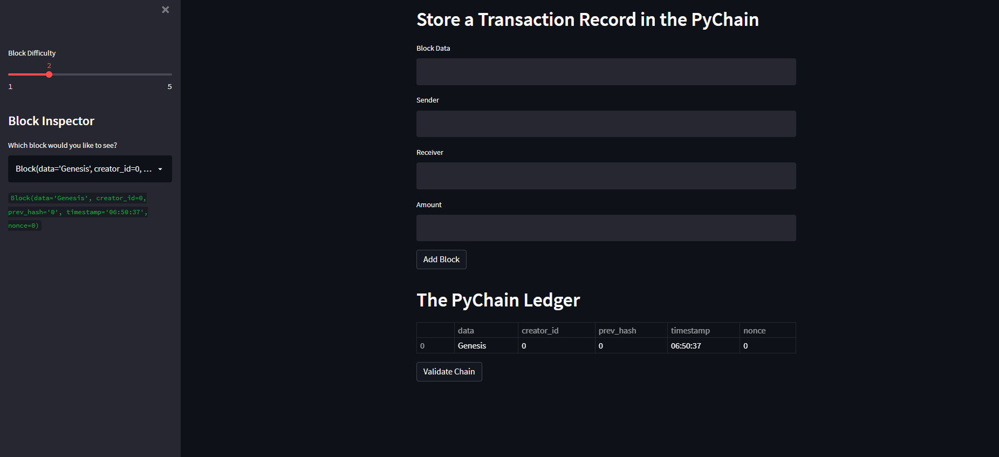

# PyChain-Ledger-Project

## I. PyChain ledger and user interface
#

As shown in these  screenshots  I has sussceffuly complete the PyChain ledger and user interface by running the  Streamlit application via my  terminal using  my development environment. I was able to  store some mined blocks in my  PyChain ledger. 

## II. Blockchain Testing and Validation 
#

I was succesfully able to vadidate the following hash during the testing process

Wining Hash 00199325d51bf169bc28d20f5b22f7e8dc02fbd4b4a09b40d4aa27d5d07b6ba4
Wining Hash 004168baffc8a9385b1fe2a298d6c370dab90f826b616eb60bd8f8b207cc7a2a
Blockchain is Valid
Wining Hash 00000b688a2cec51b7969dd044f3321f131ea840326e639d50f9c49bf0e5162a
Blockchain is Valid
Wining Hash 00e68e43f1dfef5da0375720bf0466d3d06e0765910c588b2067d857cdc0696c
Blockchain is Valid
Wining Hash 0016e3f53037c3f8b65d13ec71d81d7778989bb11ef6832d1a7b5f820c8ed423
Blockchain is Valid
Wining Hash 009ec22a5bfb91835439f6d3903a1a5845d76a37490e07f8191c10dfb7f586d7
Blockchain is Valid
Wining Hash 00000a2d594f27e272f82d469dad48f8cb6de4ab5b8070b8bc1bc12784b0b710
Blockchain is Valid

During the testing process, the block difficulty was set to 5, the nonce result retruneed a very high value:  938369

## III. Conclusion & Challenge:
#
To show case of the project, a 2 mins Video has been uploaded for review via this link  https://www.youtube.com/watch?v=u1evGyr6sG0. 
 There was one challenge in this project i wish I could resolve and test. I was not able to randomly  generate  the "creator_id". This is some interessing feature  of the PyChain-Ledger app I would like to explore in the future code. Each transation should have a unique creator_id.   